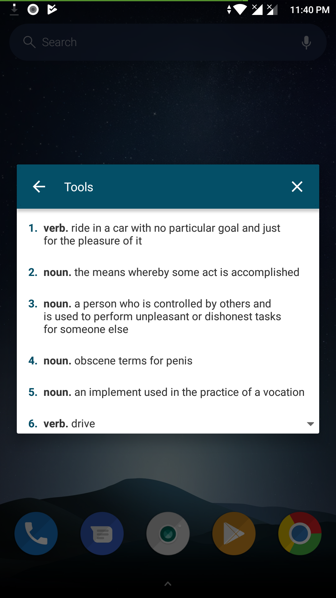
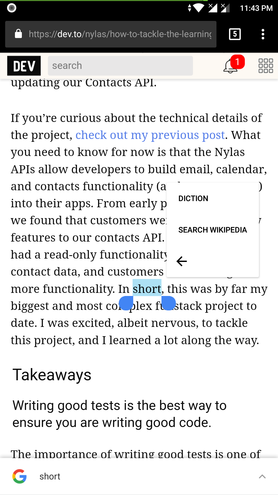
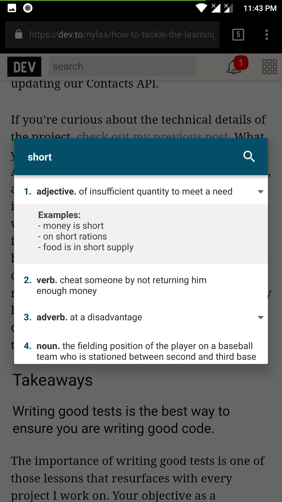

## Diction Android App

<b>Diction</b> is a popup dictionary allow the user to search the definition of the word from selection toolbar.

## Screenshots

|                           1                           |                           2                           |                           3                           |
| :---------------------------------------------------: | :---------------------------------------------------: | :---------------------------------------------------: |
|  |  |  |

### LICENCE

Released under the [MIT](./LICENSE) License.
